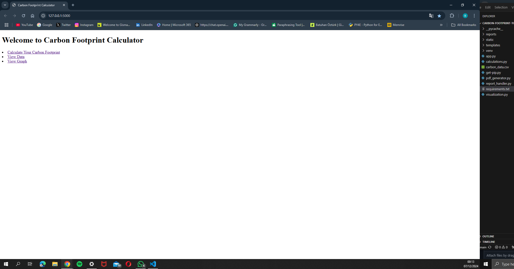
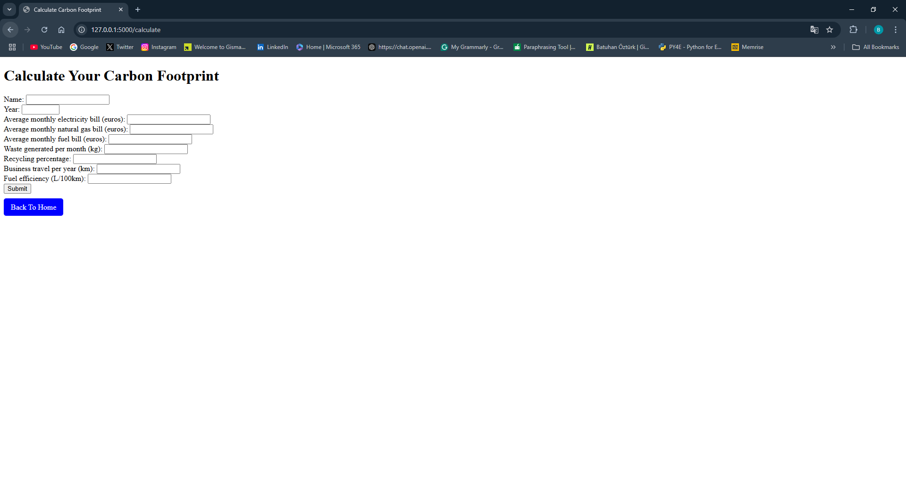
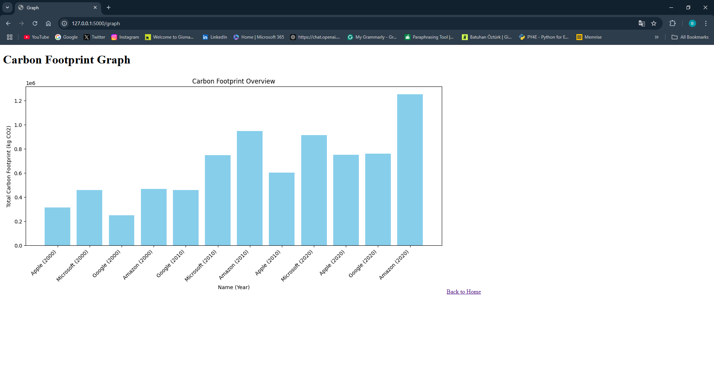
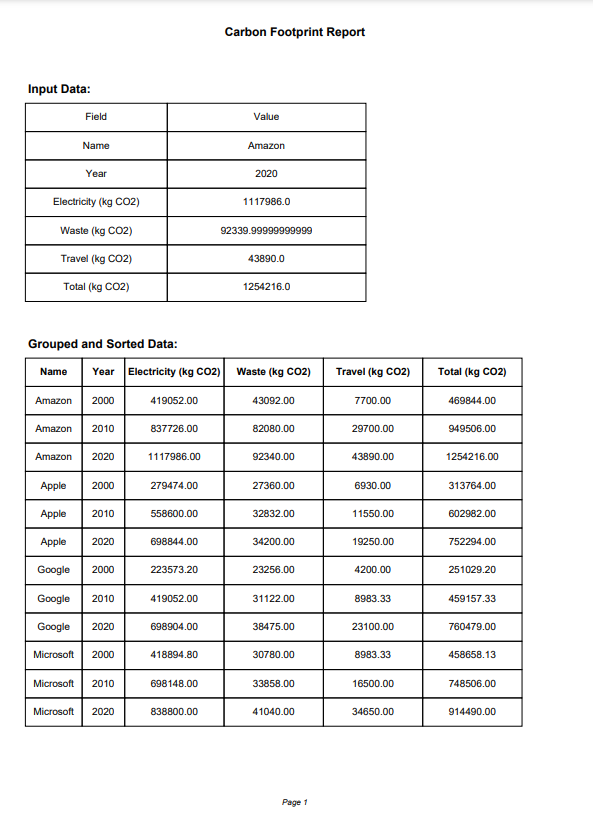
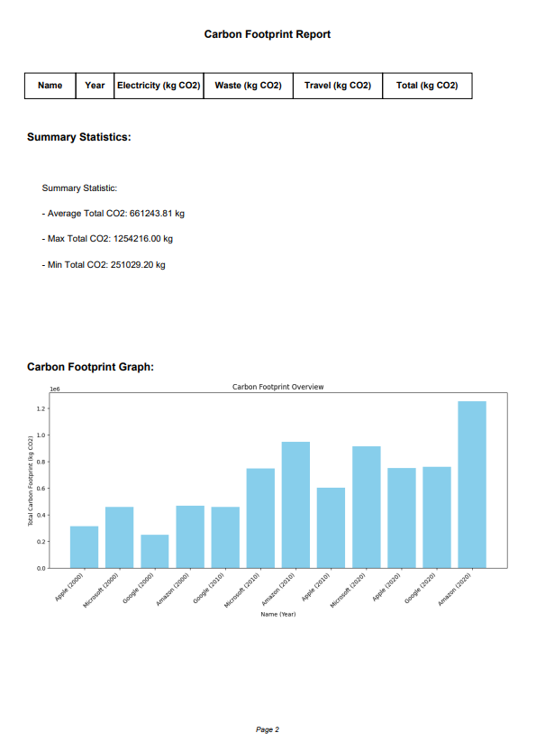
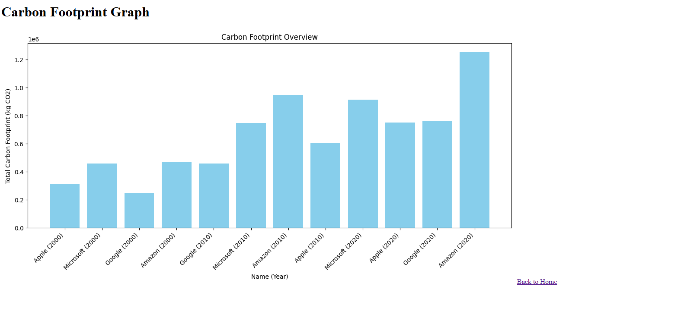

# CARBON FOOTPRINT TOOL

The ** Carbon Footprint Tool ** is a Python-based online application (web) that allows people and businesses to quanitify and evulate their carbon footprint.Users may enter data on electricity usage , 
waste production and travel to get detailed reports ,visualize their carbon footprint and gain practical ideas for lowering ther emissions.

---

## FEATURES

- **Web Interface** : An easy-to-use form for to collection electricity,waste and travel informaion(data).
- **Pdf Report Generation**: Generates thorough Pdf reports summarizing carbon foodprint data.
- **Data Visualization**: Generates bar charts to illustrate patterns in carbon foodprint over time .
- **Data Storage**: Stores all user inputs in a CSV file for further analysis.
- **Error Handling**: Validates user inputs and offers appropriate feedback when wrong data is entered.
  
---
## DEMO

Here's a brief overview of what the application provides
---

### WEB INTERFACE





### PDF REPORT




### BAR CHART VISUALIZATION



---
## INSTALLATION

These step must be steps to set up and run the project 

1. **Clone this repository**:
 
 ```bash
 git clone https://github.com/batuann48/CarbonFootprinTool.2.git
 cd CarbonFootprinTool.2. 
```

 2. **Set up a virtual environment**:

python -m venv venv
source venv/bin/activate  # On Windows: venv\Scripts\activate

 3. **Install dependencies**:

pip install -r requirements.txt

---


## USAGE

1. **Run the application**:

python app.py

2. **Open your browser and navigate to**:

http://127.0.0.1:5000

3. **Input Usage**:

-Electricity Usage  bill ( euros )

-Waste Production (in kg)

-Travel Distance(in km)

4. **View Results**:

-Download Pdf report summarizing carbon footprint.

-See visualizations of total emissions over time .


!! *Very important, take this warning into consideration* !!


-After running the application, the application web page will open.If the application web page gives a connection warning after a specific data entry is made, you need to activate the 'python app.py' code that runs the application again.


---


## FILE STRUCTURE 


-**CarbonFootprinTool.2/**:

-**│**:

-**├── app.py              # Main application file.**:      

-**├── calculations.py     # Carbon footprint calculation logic.**:    

-**├── pdf_generator.py    # PDF report generation.**:

-**├── report_handler.py   # Handles CSV storage.**:

-**├── visualization.py    # Visualization of carbon footprint data.**:

-**├── requirements.txt    # Python package dependencies.**:

-**├── carbon_data.csv     # Stores user data (auto-generated).**:

-**├── static/             # Static files (images, generated reports).**:


-**└── get-pip.py          # Used for python library.**:


---


## TECHNOLOGIES USED
- *Python: Main programming language.
- *Flask: Web framework used to construct applications.
- *Pandas: Used to manipulate and store data.
- *Matplotlib: A library for creating data visualization.
- *FPDF: Used to create Pdf reports.

## LICENSE

This project is licensed under the MIT License. See the [LICENSE](LICENSE) file for details.

